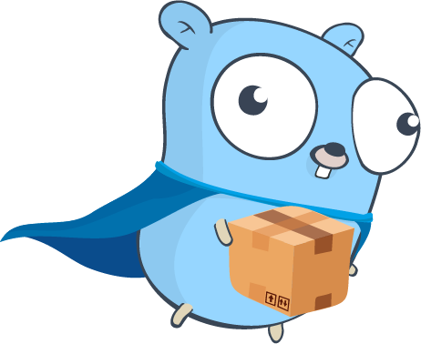

<p align="center">
  
</p>

<p align="center">
  <a href="https://github.com/AdamShannag/volare/actions/workflows/build.yml">
    
  </a>
  <a href="https://github.com/AdamShannag/volare/blob/master/go.mod">
    
  </a>
  <a href="https://github.com/AdamShannag/volare/actions/workflows/build.yml">
    
  </a>
  <a href="https://github.com/AdamShannag/volare/releases/latest">
    
  </a>
  <a href="https://github.com/AdamShannag/volare/blob/master/LICENSE">
    
  </a>
</p>

## About Volare

**Volare** is a Kubernetes volume populator that populates Persistent Volume Claims (PVCs) from multiple external
sources concurrently.

## Supported Source Types

- **S3** – AWS S3 and compatible providers
- **GitHub**
- **GitLab**
- **HTTP** – Direct file URLs

## Getting Started

### 1. Prerequisites

Before using Volare, apply the upstream VolumeDataSource validator CRDs and setup:

```bash
kubectl apply -f https://raw.githubusercontent.com/kubernetes-csi/volume-data-source-validator/v1.0.1/client/config/crd/populator.storage.k8s.io_volumepopulators.yaml
kubectl apply -f https://raw.githubusercontent.com/kubernetes-csi/volume-data-source-validator/v1.0.1/deploy/kubernetes/rbac-data-source-validator.yaml
kubectl apply -f https://raw.githubusercontent.com/kubernetes-csi/volume-data-source-validator/v1.0.1/deploy/kubernetes/setup-data-source-validator.yaml
````

### 2. Apply Volare Manifests

Apply the Volare CRDs and resources from the `manifests/` directory:

```bash
kubectl apply -f https://raw.githubusercontent.com/AdamShannag/volare/master/manifests/1.volarepopulators-crd.yaml
kubectl apply -f https://raw.githubusercontent.com/AdamShannag/volare/master/manifests/2.volumepopulator.yaml
kubectl apply -f https://raw.githubusercontent.com/AdamShannag/volare/master/manifests/3.volarepopulator.yaml
kubectl apply -f https://raw.githubusercontent.com/AdamShannag/volare/master/manifests/4.volare-controller.yaml
kubectl apply -f https://raw.githubusercontent.com/AdamShannag/volare/master/manifests/5.pvc.yaml
kubectl apply -f https://raw.githubusercontent.com/AdamShannag/volare/master/manifests/6.checker.yaml
```

## Example `VolarePopulator`

```yaml
apiVersion: k8s.volare.dev/v1alpha1
kind: VolarePopulator
metadata:
  name: volare-populator
spec:
  sources:
    - type: github
      targetPath: /github
      github:
        owner: kubernetes-csi
        repo: lib-volume-populator
        ref: master
        path: example
        # public repo       
        # token: GITHUB_TOKEN # Read from env if set, otherwise used as a raw string
    - type: s3
      targetPath: /s3
      s3:
        endpoint: s3.example.com
        bucket: data-bucket
        region: us-east-1
        accessKeyId: AWS_ACCESS_KEY # Read from env if set, otherwise used as a raw string
        secretAccessKey: AWS_SECRET_KEY # Read from env if set, otherwise used as a raw string
        secure: true
        paths:
          - data/
  workers: 4
```

## License

[MIT](LICENSE)

## Contribution

If you have any questions or want to contribute, feel free to open an issue or PR.
